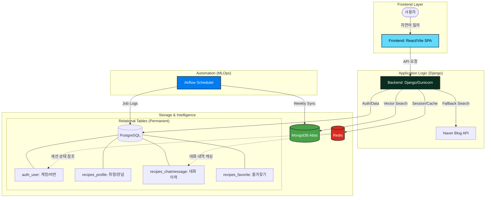

# AI 냉털봇 (v2.0): 너의 냉장고를 구해줘

# 1. 팀 소개
| 이름 | GitHub | 역할 |
| :--- | :---: | :--- |
| 권가영 | [@Gayoung03](https://github.com/Gayoung03) | Django-React 통합 아키텍처 설계 및 RAG Fallback 고도화 |
| 김연준 | [@kgbrladuswns](https://github.com/kgbrladuswns) | PostgreSQL 스키마 정규화 및 Airflow 데이터 파이프라인 구축 |
| 전운열 | [@cudaboy](https://github.com/cudaboy) | LangChain RAG 파이프라인 고도화 및 시스템 프롬프트 최적화 |
| 조은석 | [@silverstone-1004](https://github.com/silverstone-1004) | Docker 인프라 오케스트레이션 및 데이터 동기화 자동화 |
| 최유림 | [@yulim8823](https://github.com/yulim8823) | React(Vite) 기반 SPA UI 구현 및 만개의 레시피 크롤러 개발 |

# 2. 프로젝트 기간
2026.04.28 - 2026.04.29 (2차 고도화 프로젝트)

# 3. 프로젝트 개요
## 📕 프로젝트명
"AI 냉털봇 (v2.0): 너의 냉장고를 구해줘" 
(Django-React 아키텍처 기반 지능형 레시피 추천 시스템)

## ✅ 프로젝트 배경 및 목적
• **통합 아키텍처**  
  분리되어 있던 FastAPI 백엔드와 Streamlit 프론트엔드를 **Django-React 아키텍처**로 통합하여 성능과 보안, 유지보수성을 극대화했습니다.

• **데이터 자동화**  
  수동으로 관리되던 레시피 데이터를 **Airflow**를 통해 매주 자동으로 최신화하는 MLOps 파이프라인을 구축했습니다.

• **지능형 답변**  
  단순 검색을 넘어 **3단 Fallback(DB → 웹 → LLM)** 시스템을 도입하여 답변의 질과 신뢰도를 높였습니다.

## ❤️ 핵심 성과 (v2.0)
• **남는 재료 최소화**  
  이전 KPI를 유지하며, 더욱 정밀해진 RAG 검색으로 재료 소진율을 향상시켰습니다.

• **사용자 편의성**  
  React 기반의 UI와 장고의 세션 관리 기능을 통해 안정적인 사용자 경험을 제공합니다.

• **신뢰성 보장**  
  DB에 없는 레시피는 실시간 웹 검색과 LLM 추정을 통해 "출처 뱃지"와 함께 제공하여 환각 현상을 방지합니다.

# 4. 핵심 기술 및 아키텍처

## 🏗️ 서비스 및 데이터 흐름 (System Architecture)


## 💡 Why Redis? (In-memory Cache vs DB Persistence)
우리 프로젝트에서 PostgreSQL이 있는데도 굳이 Redis를 함께 사용하는 이유는 **'성능'과 '사용자 경험'** 때문입니다.

1.  **속도의 차이 (RAM vs Disk)**: PostgreSQL은 하드디스크(SSD)에 저장되어 안전하지만, 매 요청마다 디스크에서 데이터를 읽어오면 반응 속도가 느려집니다. Redis는 모든 데이터를 메모리(RAM)에 상주시켜 찰나의 순간에 응답을 보낼 수 있습니다.
2.  **부하 분산**: 로그인 유지(세션)나 최근 20개의 대화 내역 같은 데이터는 페이지를 이동할 때마다 수시로 확인해야 합니다. 이를 DB 대신 Redis가 처리하게 함으로써 PostgreSQL의 부하를 줄이고 전체 시스템의 안정성을 높였습니다.
3.  **휘발성 데이터 관리**: 로그아웃하면 사라져도 되는 일시적인 정보를 관리하기에 최적입니다.

## ⚙️ Why Airflow? (Data Automation & MLOps)
단순한 크롤링 스크립트가 아닌 Airflow를 도입한 이유는 **데이터의 신선도와 관리의 자동화**를 위해서입니다.

1.  **주기적 데이터 갱신**: '만개의 레시피'와 같은 플랫폼의 신규 데이터를 매주 정해진 시간에 자동으로 수집하여 MongoDB에 동기화합니다. 개발자가 직접 개입할 필요가 없는 **DataOps** 환경을 구축했습니다.
2.  **작업 모니터링 및 재시도**: 크롤링 중 네트워크 오류 등으로 작업이 실패했을 때, Airflow는 자동으로 재시도(Retry)를 수행하고 로그를 남겨 데이터 유실을 방지합니다.
3.  **의존성 관리 (DAG)**: 크롤링 -> 데이터 가공 -> 임베딩 -> DB 업로드로 이어지는 복잡한 단계를 체계적으로 관리하여 데이터 파이프라인의 안정성을 보장합니다.

## 📊 전략적 RAG 파이프라인 (Search Logic by Mode)
사용자의 검색 의도에 따라 최적화된 서로 다른 검색 전략을 수행합니다.

• **일반 검색 (Normal Mode)**: `DB Search` ➔ `Web Search` (**2단 Fallback**)
  - 내부 DB와 웹 검색 결과가 모두 없을 경우, 잘못된 정보를 제공하지 않기 위해 답변 생성을 중단하여 환각 현상을 방지합니다.

• **다이어트 특화 (Diet Mode)**: `DB Search` ➔ `Web Search` ➔ `LLM Inference` (**3단 Fallback**)
  - 결과가 없더라도 LLM의 전문 지식을 활용해 사용자의 알레르기와 취향을 반영한 건강 식단을 끝까지 제안합니다.

• **제철 식재료 (Seasonal Mode)**: `Monthly Data (JSON)` ➔ `Web Search`
  - 현재 날짜(월) 기반의 제철 지식 데이터를 먼저 참조한 뒤, 최신 웹 레시피를 실시간으로 요약하여 가장 신선한 정보를 제공합니다.

• **데이터 수집 자동화 (MLOps)**: `recipe_weekly_sync.py` DAG를 통해 매주 '만개의 레시피' 최신 데이터를 자동으로 크롤링하고 MongoDB에 동기화합니다. 이는 모델 학습용 데이터가 아닌 검색용 지식 베이스를 지속적으로 고도화하는 **DataOps(MLOps의 일환)** 관점으로 설계되었습니다.

# 5. 프로젝트 디렉토리 구조
```text
├── airflow/                        # Airflow 시스템 관리 폴더
│   ├── dags/                       # 자동화 파이프라인 (DAG) 정의
│   │   └── recipe_weekly_sync.py   # 주간 레시피 자동 동기화 스크립트
│   └── logs/                       # 워커(Worker) 및 스케줄러 실행 로그
├── nangteol/                       # Django 프로젝트 핵심 설정 폴더
│   ├── settings.py                 # DB 연결, 앱 등록 등 전체 환경 설정
│   ├── urls.py                     # 루트 URL 라우팅 (Admin, App 연결)
│   ├── wsgi.py                     # WSGI 서버 진입점 (배포용)
│   └── asgi.py                     # ASGI 서버 진입점 (비동기 처리용)
├── recipes/                        # 메인 서비스 어플리케이션 로직
│   ├── frontend/                   # React + Vite SPA 소스 및 빌드 환경
│   ├── rag/                        # RAG 파이프라인 핵심 모듈
│   │   ├── pipeline.py             # 3단 Fallback 오케스트레이션 로직
│   │   ├── diet_curator.py         # 다이어트 특화 큐레이션 엔진
│   │   ├── seasonal_curator.py     # 제철 식재료 데이터 기반 검색기
│   │   └── prompts.py              # LLM 시스템 프롬프트 관리
│   ├── migrations/                 # DB 스키마 변경 이력 (PostgreSQL)
│   ├── static/                     # 정적 파일 (CSS, JS, Images, React Build)
│   ├── templates/                  # Django HTML 템플릿 파일
│   ├── utils/                      # 공통 유틸리티 (Config, Helper)
│   ├── admin.py                    # 관리자 페이지 모델 등록 및 설정
│   ├── apps.py                     # 앱 설정 및 초기화 로직 (RecipeAgent 로딩)
│   ├── models.py                   # PostgreSQL 데이터 모델 정의 (Profile, Favorite)
│   ├── urls.py                     # 앱 내부 URL 라우팅 설정
│   └── views.py                    # REST API 엔드포인트 및 컨트롤러
├── docker-compose.yml              # 전체 서비스(DB, Redis, Web, Airflow) 컨테이너 설정
└── .env                            # API Key, DB URI 등 민감 정보 환경 변수 관리
```

# 6. 기술 스택
- **Web Framework & UI**
  - 
  - 
  - 

- **Data Engineering & AI**
  - 
  - 
  - 

- **Infrastructure**
  - 
  - 
  - 

# 7. 향후 과제 (Future Works)
• **사진 기반 재료 자동 인식 (Vision AI)**: 냉장고 사진 분석을 통한 자동 재료 입력 기능.
• **멀티모달 답변**: 조리 과정 이미지 생성 및 실제 조리 영상 연동 인터페이스.

# 8. 수행 결과 (v2.0)
*(여기에 4차 프로젝트 작동 스크린샷이나 시연 영상을 삽입하세요)*
